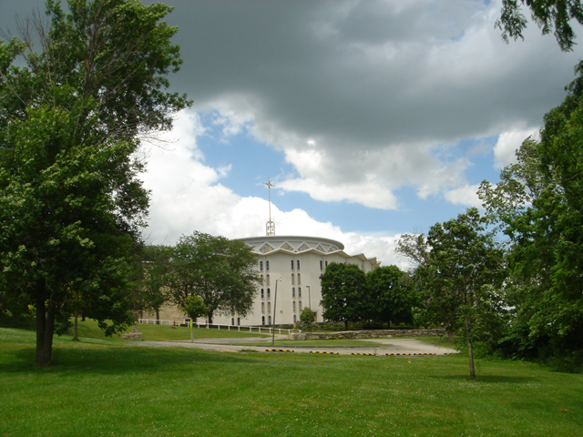
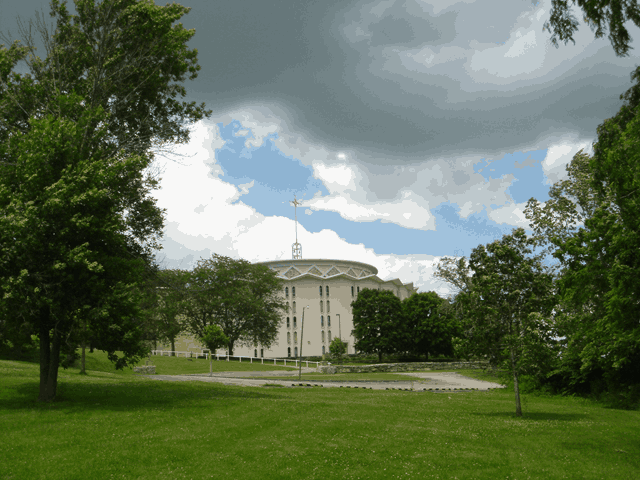
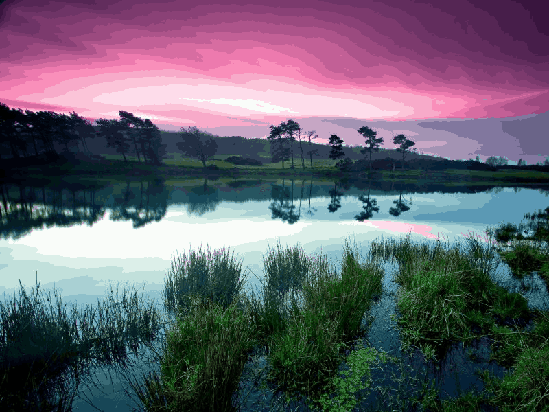
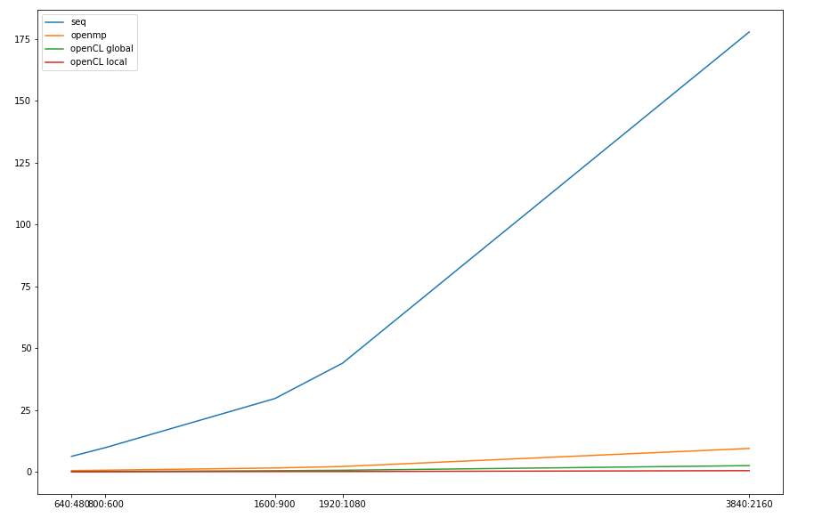
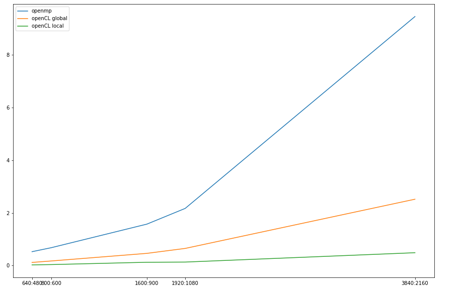
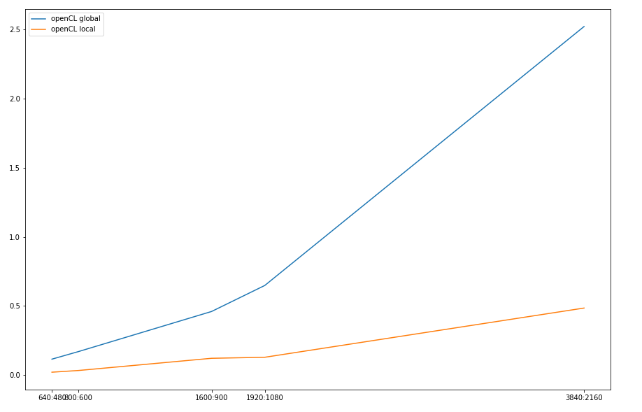

# 50 iterations, 64 colors (clusters)

## Sequiential compresson

| Image Size  | Time         |
| ----------- | ------------ |
| 640 : 480   | 6.278798 s   |
| 800 : 600   | 9.805754 s   |
| 1600 : 900  | 29.638070 s  |
| 1920 : 1080 | 43.966289 s  |
| 3840 : 2160 | 177.867248 s |

- In my algorithm I use structures for: the image, the clusters (they hold **RGB** values like: [[RGB], [RGB], [RGB], ...]) and pointer to the cluster an image point belongs to.
- I use two main (three if I count the iterations) for loops:
  - go through every point of the picture and for every cluster find the smallest distance (Euclidean distance) of the **RGB** values to the point, when found assign the cluster with the smallest distance to the point (using the above aforementioned structure).
  - go through every cluster, average up the points that belong to that cluster and assign the average to the cluster.

## OpenMP

- The parallelization with **openMP** was very successful at my end. I used two **#pragma omp parallel for** before my main loops.
- This worked really well because I don't use a strucutre for my **sum** and **n** of the clusters (which I later had to use to implement it on **openCL**). On the second for loop (which I go through every cluster), I go through each point and find the point of the cluster and calculate its **sum** and **n** "on the fly". For this, my **openMP** parallelization was very successful. But, because of this I had to pay time for the sequiential compression, which is very slow.
- **openMP** parallelization has the same speedup of the sequiential for 
every picture size.

*The speedups are sequiential algorithm compresson time divided by current parallelization algorithm time.

| **Threads** | **Image Size** | **Time**    | **Speedup**        |
| ----------- | -------------- | ----------- | ------------------ |
| **16**      | 640 : 480      | 0.531060 s  | 11.82314239445637  |
| **16**      | 800 : 600      | 0.839067 s  | 11.68649702586325  |
| **16**      | 1600 : 900     | 2.548885 s  | 11.627856886442503 |
| **16**      | 1920 : 1080    | 3.760438 s  | 11.691799997766218 |
| **16**      | 3840 : 2160    | 14.870997 s | 11.960680780179029 |
|             |                |             |                    |
| **32**      | 640 : 480      | 0.565514 s  | 11.102816199068458 |
| **32**      | 800 : 600      | 0.960154 s  | 10.21268879783868  |
| **32**      | 1600 : 900     | 2.422474 s  | 12.234628730793396 |
| **32**      | 1920 : 1080    | 3.553231 s  | 12.373608414426196 |
| **32**      | 3840 : 2160    | 13.981206 s | 12.721881645975317 |
|             |                |             |                    |
| **64**      | 640 : 480      | 0.524497 s  | 11.971084677319412 |
| **64**      | 800 : 600      | 0.675236 s  | 18.695538773339027 |
| **64**      | 1600 : 900     | 1.572185 s  | 18.851515565916223 |
| **64**      | 1920 : 1080    | 2.169725 s  | 20.26353063176209  |
| **64**      | 3840 : 2160    | 9.463065 s  | 18.795944865643424 |

| Original Spiderman picture | Compressed with openMP parallelization |
| :------------------------: | :------------------------------------: |
|   |    |

## OpenCL

### Host
- I initialize variables:
  - clusters.
  - **sum** for clusters - [[sum for R value, sum for G value, sum for B value], ...].
  - **n** for clusters - how many points does the cluster have, we use this for the .calculation of the average.
  - which point has which cluster.
- set the clusters to random point of the image.
- create memory objects which are readable and writeable.
- set the kernels' arguments.
- divide the workload:
  - first kernel: local item size is 256, global is the size of the image.
  - second kernel: local item size is 64, global is 256.
- execute kernels for every iteration.
- calculate time using openMP function.
- read objects back to the host where we set them to the image.
- free up memory.

### Device
We have a one .cl kernel file which has 2 functions.
- **Min_euc_dist**
  - assign every point to the nearest cluster (I went through this earlier).
  - have to update the cluster **sums** and **n**.
    - I do this by using the **atomic_add** and **atomic_inc** funciton from openCL.
- **Set_avg**
  - here we go through every cluster and use the above aforementioned structures for **sum** and **n** to set the average for each cluster.
  - main problem I had with parallelization on openCL was the giving a random point to a cluster when it was empty. With a little bit of research, I solved this by passing a ulong seed (123456789) to the kernel and from it calculating a random uint.  
  - also, I had to reset the **sums** and **n** for every cluster passing, so that the next one has them set at 0.

### Results

| **Image Size** | **Time**   | **Speedup**       |
| -------------- | ---------- | ----------------- |
| 640 : 480      | 0.116246 s | 54.01302410405519 |
| 800 : 600      | 0.171157 s | 57.29099014355241 |
| 1600 : 900     | 0.460573 s | 64.35042870511298 |
| 1920 : 1080    | 0.648512 s | 67.79564449077273 |
| 3840 : 2160    | 2.518930 s | 70.61222344408141 |

- The spiderman picture is a 940 : 850 and, it takes 0.280680 seconds on GPU.

| Original Spiderman picture | Compressed with openCL GPU parallelization |
| :------------------------: | :----------------------------------------: |
|   |    |

| Original 640 480 picture | Compressed with openCL GPU parallelization |
| :----------------------: | :----------------------------------------: |
|       |          |

| Original 800 600 picture | Compressed with openCL GPU parallelization |
| :----------------------: | :----------------------------------------: |
|       |          |

| Original 1600 900 picture | Compressed with openCL GPU parallelization |
| :-----------------------: | :----------------------------------------: |
|       |         |

| Original 1920 1080 picture | Compressed with openCL GPU parallelization |
| :------------------------: | :----------------------------------------: |
|        |         |

| Original 3840 2160 picture | Compressed with openCL GPU parallelization |
| :------------------------: | :----------------------------------------: |
|        |         |

### Local memory implementation

- Just save the clusters in a local variable and put a barrier.

Using openCL with local memory implementation yielded the best current best results. The compressed image quality was the same as the before results.

| **Image Size** | **Time**   | **Speedup**        |
| -------------- | ---------- | ------------------ |
| 640 : 480      | 0.022038 s | 284.9077956257374  |
| 800 : 600      | 0.034357 s | 285.4077480571645  |
| 1600 : 900     | 0.122467 s | 242.0086227310214  |
| 1920 : 1080    | 0.129836 s | 338.62941711081675 |
| 3840 : 2160    | 0.485366 s | 366.4600487055129  |

# Graph results

Results for all the algorithms.

Results for all the parallel algorithms.

Results for openCL parallelization with local and global memory.

